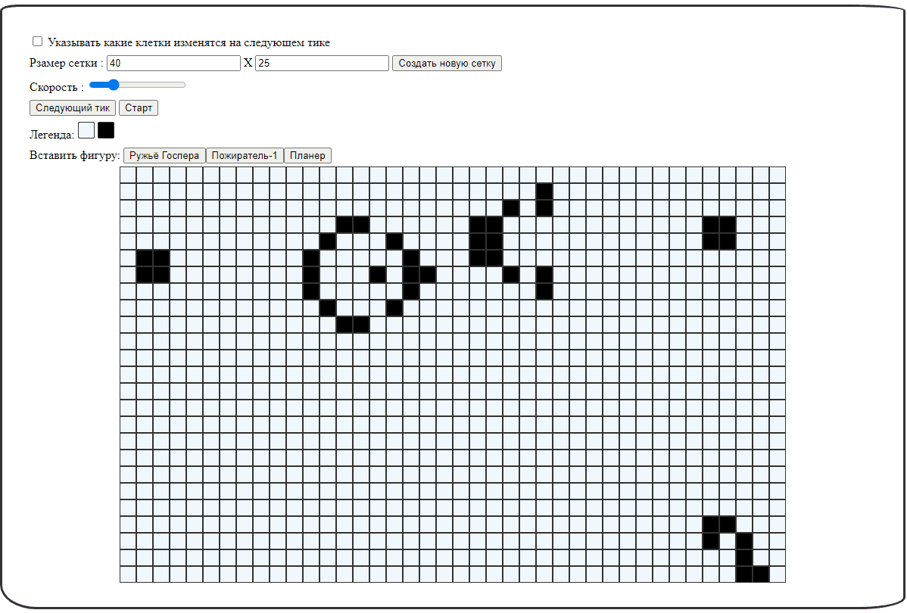

<br/>
<p align="center">
  <h3 align="center">Игра Жизнь</h3>
  <p align="center">
    Typescript приложение реализующую игру <a href="https://ru.wikipedia.org/wiki/%D0%98%D0%B3%D1%80%D0%B0_%C2%AB%D0%96%D0%B8%D0%B7%D0%BD%D1%8C%C2%BB">"Жизнь"</a>.
    <br/>
    <br/>
  </p>
</p>

[](https://github.com/SergeyAkkuratov/OTUS_homework_lesson20/actions/workflows/pull_request_check.yml)
 


## Содержание

- [О проекте](#о-проекте)
- [Установка](#установка)
- [Использование](#использование)

## О проекте

Игра «Жизнь» (англ. Game of Life) — клеточный автомат, придуманный английским математиком Джоном Конвеем в 1970 году.[1] Это игра без игроков[2][3], в которой человек создаёт начальное состояние, а потом лишь наблюдает за её развитием. В игре можно создать процессы с полнотой по Тьюрингу, что позволяет реализовать любую машину Тьюринга.

Данное приложение является одной из многочисленных реализаций игры "Жизнь".  
Данная реализация позволяет настраивать размеры поля, скорость выполнения алгоритма, пошаговое выполнение и постановку 3-х основных элементов на поле.



## Требования

Для локального запуска приложения вам потребуется [npm](https://docs.npmjs.com/downloading-and-installing-node-js-and-npm).

## Установка

Для локального запуска приложения вам нужно склонировать проект, скачать зависимости и скрипт запуска:

```bash
git clone https://github.com/SergeyAkkuratov/OTUS_homework_lesson47.git ./game_life

cd ./game_life

npm install

npm start

```

Приложение будет доступно по адресу http://localhost:8080/.

Так же попробовать приложение можно [онлайн](https://sergeyakkuratov.github.io/OTUS_homework_lesson20/).

## Использование

Органы управления приложения:

1. Переключатель допполнительных указателей на поле.
   

   При установленой отметки на поле игры улетки будут окрашиваться дополнительными цветами: синий - для келтки, которая появится на следующем тике и серый - для клетки, которая умрёт на следующем тике.

1. Поля для задания размеры сетки
   

   В полях можно указывать ширину и высоту поля игры. При имзенений значений в полях изменения будут происходит автоматически. Для того, чтобы создать новое поле с заданнами размерами, нужно нажать кнопку "Создать новую сетку".

1. Ползунок регулировки сокрости
   

   Ползунок регулирует скорость переключения игрового поля на следующий тик.  
   Регулировать скорость можно также кнопками стрелок вверх (увеличивает) и вниз (уменьшает).

1. Запуск выполнения алгоритма и пошаговое выполнение
   

   Кнопка "Следующий тик" переводит поле игры на состояние следующего тика.  
   Кнопка "Старт" щапускает автоматического переключения поля игры на состояния следующего тика через небольшую задрежку (величина зависит от скорости).  
   Кнопка "Старт" также можно нажать при помощи нажатия на "Пробел".  
   При запущенном приложении задний фон темнеет и появляется кнопка "Стоп", которая позволяет остановить выфполнение алгоритма.  
   Так же остановить игру можно нажатием на "Пробел".

1. Легенда поля
   

   Легенда описывает, что означает цвет квадратиков поля игры.

1. Вставка фигур
   

   В приложении заранее подготовлены 3 основные фигуры для вставки на поля игры.  
   При нажатии на одну из кнопок, вы можете повести мышку на поле игры и увидеть, как будет размещаться будущая фигура.  
   Клики мышки установит фигуру на поле.  
   Клик мышки вне поля игры сбросит установку фигуры.

1. Поле игры
   

   Поля игры отображает текущее состояние клеток.  
   Вы можете редактировать состояние клеток кликнув на них мышкой. Если поле было пустое - будет установлена новая живая клетка. И наоборот.
